<p align="center">
  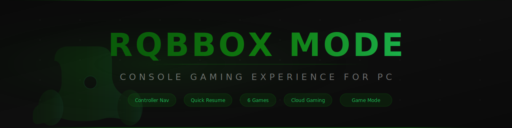
</p>

<h1 align="center">
  
  RQBBOX MODE ®
  
</h1>

<p align="center">
  <strong>🎮 Plug Into Gaming. ®</strong><br>
  A full-screen, controller-optimized gaming mode for PC, inspired by Xbox Mode on Windows 11.
</p>

<p align="center">
  <a href="https://rtech-rqbbox-os.github.io/RQBBOX-MODE">
    
  </a>
  <a href="https://github.com/Rtech-Rqbbox-os/RQBBOX-MODE/blob/master/LICENSE">
    
  </a>
  <a href="https://github.com/Rtech-Rqbbox-os/RQBBOX-MODE">
    
  </a>
  <a href="https://github.com/Rtech-Rqbbox-os/RQBBOX-MODE/stargazers">
    
  </a>
  <a href="https://github.com/Rtech-Rqbbox-os/RQBBOX-MODE/network/members">
    
  </a>
</p>

<p align="center">
  
  
  
  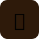
  
  
  
  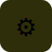
  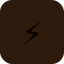
  
  
  
</p>

---

Turn any PC into a console-like gaming experience. Full controller navigation, Quick Resume, performance optimization, achievements, game DVR, cloud gaming, and 6 built-in games.

## 🎮 Features

| Icon | Feature | Description |
|:----:|---------|-------------|
|  | **Fullscreen Dashboard** | Console-style full-screen gaming interface with horizontal scrolling rows, hero banners, and tile-based navigation |
|  | **Controller Navigation** | Full gamepad support — D-pad navigate, A select, B back, Guide button for menu. Vibration feedback. |
|  | **Quick Resume** | Suspend games and resume instantly (up to 3 slots). Inspired by Xbox Quick Resume technology. |
|  | **Performance Mode** | One-click performance optimization — reduces visual effects, frees memory, maximizes FPS. Balanced/Maximum/Quality modes. |
|  | **Game Library** | Unified game catalog with installed, recent, and favorites tracking. Launch HTML5 games directly. |
|  | **Achievement System** | 12 achievements to unlock with popup notifications and vibration feedback. |
|  | **Game DVR & Captures** | Screenshot capture and screen recording (Game DVR). Capture your gaming moments. |
|  | **Social Features** | Friends list, friend requests, online status, activity feed. |
|  | **Theme Engine** | 4 built-in themes: Default (cyan), Dark (purple), Neon (magenta), Xbox Green. |
|  | **Settings Panel** | Full settings UI with General, Display, Controller, Performance, Audio, Capture, Theme, Social, Startup tabs. |
|  | **FPS Monitor** | Real-time FPS overlay with performance stats. |
|  | **Boot Animation** | Console-style boot sequence with loading bar. |
|  | **Cloud Gaming** | Xbox Cloud Gaming integration — stream games directly from the dashboard. |
|  | **Parental Controls** | Set play time limits, content restrictions, and PIN-protected settings. |
|  | **Audio Controls** | Master volume, UI sounds, controller vibration settings. |
|  | **Display Settings** | Theme, clock, FPS counter, background blur, UI scale. |
|  | **Windows Integration** | Game Mode, GameDVR, Start Menu shortcut, Desktop Context Menu. |
|  | **Auto-Start on Boot** | Launches automatically on Windows logon — boots directly into gaming mode. |

---

## 🕹️ Built-In Games

<p align="center">
  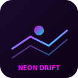
  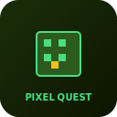
  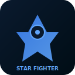
  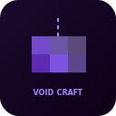
  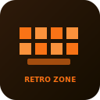
  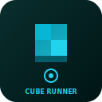
</p>

| Icon | Game | Category | Controls |
|:----:|------|----------|----------|
|  | **Neon Drift Racing** | 🏎️ Racing | Left/Right arrows to steer |
|  | **Pixel Quest** | ⚔️ Adventure | Arrow keys to move • Collect gems |
|  | **Star Fighter X** | 🚀 Action | Arrow keys to move • Space to shoot |
|  | **Void Craft Sandbox** | 🔮 Sandbox | Left-click to place • Right-click to remove |
|  | **Retro Zone** | 🕹️ Retro | Arrow keys to move paddle |
|  | **Cube Runner 3D** | 🎲 Action | Arrow keys to dodge obstacles |

---

## 🚀 Quick Start

### Windows
```
1. Double-click "Launch RQBBOX MODE.bat"
2. Server starts at http://127.0.0.1:19778/
3. Opens dashboard automatically
```

### Manual Start
```sh
npm start
# or
node server.js
# Then open http://127.0.0.1:19778/dashboard
```

---

## 🏗️ Architecture

```
RQBBOX_MODE/
├── 📄 server.js                 # Node.js HTTP server (API + static files)
├── 📄 dashboard.html            # Main full-screen dashboard
├── 📄 index.html                # Launch page
├── 📄 windows-settings.html     # Windows Settings page
├── 📄 manifest.json             # PWA manifest
├── 📄 config.json               # User configuration
├── 📄 profiles.json             # User profiles, achievements, sessions
├── 🎨 assets/
│   ├── 🖼️ logo.svg              # Main logo (512x512)
│   ├── 🖼️ banner.svg            # README banner (1280x320)
│   ├── 🖼️ favicon.svg           # Browser favicon
│   ├── 🖼️ social-preview.svg    # Social media preview
│   ├── 🖼️ og-image.svg          # Open Graph image
│   ├── 🖼️ rqbbox-icon.svg       # App icon
│   └── 📁 icons/                # 50+ feature icons
│       ├── 🏠 home.svg
│       ├── 🎮 games.svg
│       ├── ⏸️ resume.svg
│       ├── 📷 captures.svg
│       ├── 🛒 store.svg
│       ├── 👥 friends.svg
│       ├── ⚙️ settings.svg
│       ├── ⚡ performance.svg
│       ├── 🏆 achievements.svg
│       ├── 🎨 themes.svg
│       ├── ☁️ cloud.svg
│       ├── 🔒 parental.svg
│       └── ... (50+ more)
├── 🎨 css/
│   ├── 📄 main.css               # Core styles
│   └── 📁 themes/                # Theme CSS files
│       ├── 🎨 default.css
│       ├── 🎨 dark.css
│       ├── 🎨 neon.css
│       └── 🎨 xbox.css
├── 📜 js/
│   ├── 📄 core.js                # Core engine & utilities
│   ├── 📄 app.js                 # Main app initialization
│   ├── 📄 controller.js          # Gamepad navigation & polling
│   ├── 📄 performance.js         # Performance optimization engine
│   ├── 📄 library.js             # Game library manager
│   ├── 📄 quick-resume.js        # Quick Resume system
│   ├── 📄 settings.js            # Settings UI panels
│   ├── 📄 overlay.js             # Guide overlay & notifications
│   ├── 📄 capture.js             # Screenshot & Game DVR
│   ├── 📄 achievements.js        # Achievement system
│   ├── 📄 social.js              # Friends & social features
│   ├── 📄 store.js               # Game store/catalog
│   ├── 📄 themes.js              # Theme switcher
│   ├── 📄 task-switcher.js       # Controller-friendly Alt+Tab
│   ├── 📄 game-optimized.js      # Disable notifications while gaming
│   ├── 📄 performance-overlay.js # FPS/CPU/RAM overlay
│   ├── 📄 background-suppression.js # Pause background tasks
│   ├── 📄 cloud-gaming.js        # Xbox Cloud Gaming
│   ├── 📄 social-panel.js        # Friends list with parties
│   ├── 📄 achievement-tracker.js # Achievement popups
│   ├── 📄 wishlist.js            # Game wishlist
│   └── 📄 parental-controls.js   # Parental controls
├── 🎮 games/
│   ├── 📄 catalog.json           # Game library manifest
│   ├── 📁 neon-drift-racing/     # 🏎️ Playable HTML5 game
│   ├── 📁 pixel-quest/           # ⚔️ Playable HTML5 game
│   ├── 📁 star-fighter-x/        # 🚀 Playable HTML5 game
│   ├── 📁 void-craft-sandbox/    # 🔮 Playable HTML5 game
│   ├── 📁 retro-zone/            # 🕹️ Playable HTML5 game
│   └── 📁 cube-runner-3d/        # 🎲 Playable HTML5 game
├── 📱 apps/
│   └── 📄 catalog.json           # Web app integrations
├── 📸 captures/                  # Screenshots & recordings
├── 💻 windows/
│   ├── 📄 rqbbox-launcher.js     # Protocol handler
│   ├── 📄 rqbbox-mode.js         # Windows integration
│   ├── 📄 rqbbox-mode.reg        # Registry entries
│   ├── 📄 game-scanner.ps1       # Game scanner
│   └── 📁 scripts/               # Installation scripts
└── 📦 package.json               # npm package
```

### 📡 API Endpoints

| Icon | Endpoint | Method | Description |
|:----:|----------|--------|-------------|
| ⚙️ | `/api/config` | GET/POST | System configuration |
| 👤 | `/api/profiles` | GET/POST | User profiles |
| 🎮 | `/api/games` | GET | Game library catalog |
| 📱 | `/api/apps` | GET | Apps catalog |
| 🏆 | `/api/achievements` | GET | List achievements |
| 🏆 | `/api/achievements/unlock` | POST | Unlock achievement |
| 👥 | `/api/friends` | GET | Friends list & requests |
| ⏸️ | `/api/quick-resume` | GET/POST | Quick Resume sessions |
| ⚡ | `/api/performance` | GET | Performance stats |
| 🎨 | `/api/themes` | GET | Available themes |
| 📸 | `/api/screenshot` | POST | Save screenshot |
| 📷 | `/api/captures` | GET | Captures list |
| 🚀 | `/api/launch` | POST | Launch a game |
| 🔐 | `/api/auth` | POST | Sign in |
| 📝 | `/api/register` | POST | Create account |
| 🎮 | `/api/gamemode` | POST | Toggle Windows Game Mode |
| 🔍 | `/api/games/scan` | GET | Scan for installed games |
| 🖥️ | `/api/sysinfo` | GET | System information |
| ❤️ | `/api/health` | GET | Server health check |

---

## 🕹️ Controller Bindings

| Button | Icon | Action |
|--------|:----:|--------|
| D-pad | 🧭 | Navigate UI |
| A (Bottom) | 🟢 | Select / Activate |
| B (Right) | 🔴 | Back / Close |
| X (Left) | 🔵 | Menu |
| Y (Top) | 🟡 | Guide |
| Guide (Xbox) | 🎮 | Open Guide overlay |
| Start/Menu | ▶️ | Context menu |

### ⌨️ Keyboard Shortcuts

| Shortcut | Action |
|----------|--------|
| `Ctrl+Shift+F` | ⛶ Toggle fullscreen |
| `Ctrl+Shift+P` | ⚡ Toggle performance mode |
| `Ctrl+Shift+S` | 📸 Take screenshot |
| `Ctrl+Shift+R` | ⏸️ Clear Quick Resume |
| `Ctrl+Tab` | 🔄 Task Switcher |
| `Ctrl+Shift+F` | 📊 Toggle FPS overlay |
| `Escape` | ↩️ Back / Close overlay |
| `Ctrl+1-7` | 📄 Navigate pages |

---

## 📦 Editions

RQBBOX MODE is part of the RQBBOX OS ecosystem by RhysTech.

-  **RQBBOX OS Lite** — Basic gaming launcher
-  **RQBBOX OS Pro** — Full features including RQBBOX MODE
-  **RQBBOX OS Creator** — Pro + SDK, plugin/theme editor

---

## 🛠️ Development

Technologies: **Node.js** (server), **Vanilla JS** (client), **HTML5 Canvas** (games), **CSS3** (UI)

Built as a standalone project that integrates with RQBBOX OS.

---

## 🖥️ RQBBOX OS Portable USB

<p align="center">
  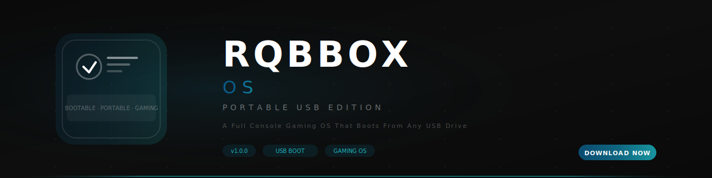
</p>

**RQBBOX OS Portable USB** is a full bootable gaming operating system that runs entirely from a USB drive. It brings the RQBBOX MODE console experience to any PC without installation.

| Feature | Description |
|---------|-------------|
| 📦 **Portable** | Boots from any 8GB+ USB drive |
| 🚀 **Lightweight** | Linux-based, optimized for gaming |
| 🎮 **Full RQBBOX MODE** | Built-in dashboard, games, and apps |
| 🔄 **Persistent Storage** | Save games and settings across boots |
| ⚡ **Performance Tuned** | Low-latency kernel for maximum FPS |

> **Repository:** [github.com/Rtech-Rqbbox-os/RQBBOX-OS](https://github.com/Rtech-Rqbbox-os/RQBBOX-OS)  
> **More info:** [docs/wiki/rqbbox-os.md](docs/wiki/rqbbox-os.md)

---

## Brand Assets

| Asset | Preview | Description |
|-------|---------|-------------|
| RQBBOX MODE Logo | `assets/logo.svg` | Full 512×512 gamepad logo |
| RQBBOX MODE Banner | `assets/banner.svg` | 1280×320 README banner |
| RQBBOX MODE Mark | `assets/logo-mark.svg` | Gamepad icon mark |
| RQBBOX MODE Horizontal | `assets/logo-horizontal.svg` | Horizontal logo layout |
| **RQBBOX OS Logo** | `assets/rqbbox-os-logo.svg` | RQBBOX OS 512×512 logo |
| **RQBBOX OS Banner** | `assets/rqbbox-os-banner.svg` | RQBBOX OS 1280×320 banner |
| Icon Set (60 SVGs) | `assets/icons/` | Full icon library for all features |

---

## 📄 License

MIT License — © 2026 RhysTech

RQBBOX® is a trademark of RhysTech. All rights reserved.

---

<p align="center">
  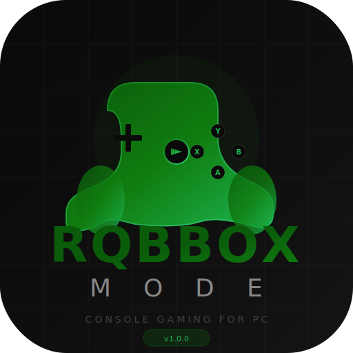
  &nbsp;&nbsp;&nbsp;
  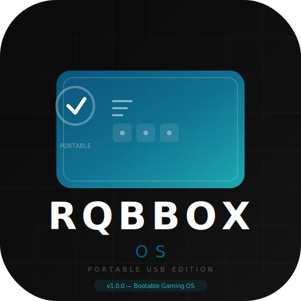
  <br>
  <em>🎮 Plug Into Gaming. ® — ⚡ Boot Into Gaming.</em>
</p>
